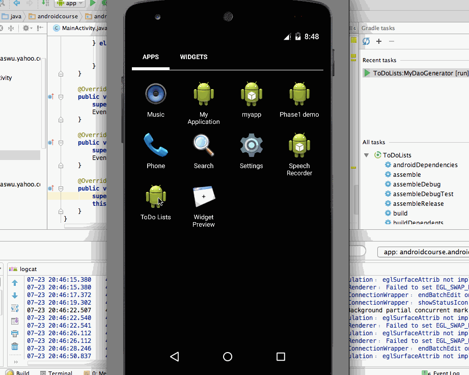

# Pre-work - *ToDoList*

**ToDoList** is an android app that allows building a todo list and basic todo items management functionality including adding new items, editing and deleting an existing item.

Submitted by: **Jonas Wu**

Time spent: **5** hours spent in total

## User Stories

The following **required** functionality is completed:

* [Y] User can **successfully add and remove items** from the todo list
* [Y] User can **tap a todo item in the list and bring up an edit screen for the todo item** and then have any changes to the text reflected in the todo list.
* [Y] User can **persist todo items** and retrieve them properly on app restart

The following **optional** features are implemented:

* [Y] Persist the todo items [into SQLite](http://guides.codepath.com/android/Persisting-Data-to-the-Device#sqlite) instead of a text file
* [Y] Improve style of the todo items in the list [using a custom adapter](http://guides.codepath.com/android/Using-an-ArrayAdapter-with-ListView)
* [N] Add support for completion due dates for todo items (and display within listview item)
* [Y] Use a [DialogFragment](http://guides.codepath.com/android/Using-DialogFragment) instead of new Activity for editing items
* [N] Add support for selecting the priority of each todo item (and display in listview item)
* [Y] Tweak the style improving the UI / UX, play with colors, images or backgrounds

The following **additional** features are implemented:
* [Y] long click to trigger editview
* [Y] close app by back press
* [Y] use [greenDao](http://greendao-orm.com/) as ORM model generator, which the dao module generator project is also included as a module.
* [Y] Try to integrate [EventBus](http://greenrobot.github.io/EventBus/) library to
         1. unify the communication interface between components
         2. prevent potential bug about updating view from thread in the future.

## Video Walkthrough

Here's a walkthrough of implemented user stories:

GIF created with [LiceCap](http://www.cockos.com/licecap/).

## License

    Copyright 2015 Jonas Wu

    Licensed under the Apache License, Version 2.0 (the "License");
    you may not use this file except in compliance with the License.
    You may obtain a copy of the License at

        http://www.apache.org/licenses/LICENSE-2.0

    Unless required by applicable law or agreed to in writing, software
    distributed under the License is distributed on an "AS IS" BASIS,
    WITHOUT WARRANTIES OR CONDITIONS OF ANY KIND, either express or implied.
    See the License for the specific language governing permissions and
    limitations under the License.
